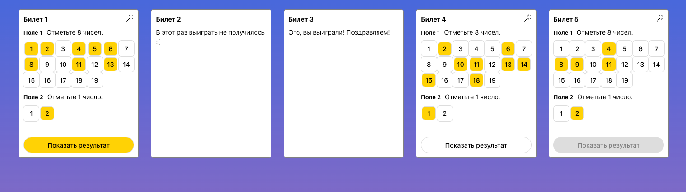

# Проект: игра «Лото»


## Как запустить проект локально:
1. Клонировать репозиторий с проектом:
```bash
git clone https://github.com/shulepovalidiya/lotto-game.git
```
2. Перейти в директорию с проектом:
```bash
cd lotto-game
```
3. Установить зависимости:
```bash
npm install
```
4. Запустить проект — он автоматически откроется в браузере по адресу http://localhost:3000/
```bash
npm run dev
```
### Запуск тестов
```bash
npm run test
```

## Технические требования
- Реализовать логику правил игры. Правила описаны в директории `docs` — 
ознакомиться можно по [ссылке](docs/games/8_out_of_19.md)
- Аккуратный, чистый код с использованием линтеров (ESLint) приветствуется 
- При разработке использовать React любой предпочитаемой версии. Для быстрой первоначальной настройки проекта допустимо использовать Create React App
- Адаптивная mobile-first вёрстка, условно приближенная к [макету](https://www.figma.com/file/VDraSBJhGzDKP33eS4IBbp6Z/Finch_test)
- Реализовать генерацию случайно выбранных полей в билете в соответствии с правилами лотереи по нажатию на значок волшебной палочки
- Реализовать логику отправки выбранных чисел на сервер по любому url. Отправка должна происходить после нажатия на кнопку "Показать результат". В данных отправки должен быть объект:
```javascript
{
  selectedNumber: { 
    firstField: [ ... ], 
    secondField: [ ... ] 
  },
  isTicketWon: ...
}
```
Нужно предусмотреть ситуацию, что в ответ придёт код не `200 OK`, а любой другой. 
В таком случае требуется отправлять запрос ещё два раза с интервалом 2 секунды. Если ответ `200 OK` так и не пришёл, то выдать какое-либо уведомление об ошибке.


## Комментарии по выполненному заданию

**Реализованы все пункты задания:**
- [x] Логика игры «8 из 19» по ТЗ
- [x] Чистый код: используется ESLint (за основу взят airbnb style guide), prettier, lint-staged
- [x] Использован React версии 18 и Vite для сборки
- [x] Адаптивная mobile-first вёрстка, условно приближенная к [макету](https://www.figma.com/file/VDraSBJhGzDKP33eS4IBbp6Z/Finch_test)
- [x] Реализована генерация случайно выбранных полей в билете: [Magic wand](src/components/MagicWand/MagicWand.tsx)
- [x] Реализована логика отправки выбранных чисел на сервер (использован https://httpstat.us/ в качестве тестового backend), с двумя дополнительными попытками с задержкой 2 секунды (если в ответ придёт код не `200 OK`, а любой другой), уведомление об ошибке и успешном запросе

**Дополнительно:**
- [x] Заложена возможность использования любых других конфигураций игр, например, «9 из 20», «11 из 15», «10 из 10», «100 из 100» и так далее), а также любого количества билетов
- [x] Написаны unit тесты
- [x] Использован TypeScript
- [x] Кастомный React-хук `useNumberSelection` для управления выбором чисел в полях билета
- [x] [Деплой Github Pages](https://shulepovalidiya.github.io/lotto-game/)

**Допущения:**
- Тело запроса негибкое, сделано для соблюдения ТЗ
- Не хватило времени на визуализацию результата со сравнением выбранной и выигрышной комбинаций, вместо этого результаты выводятся в консоль для удобства проверки 
